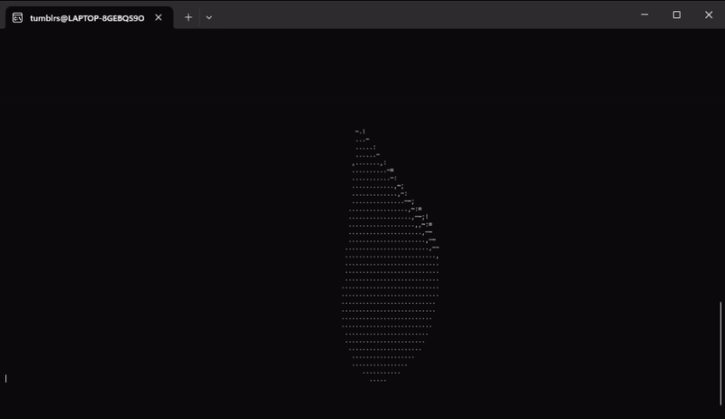
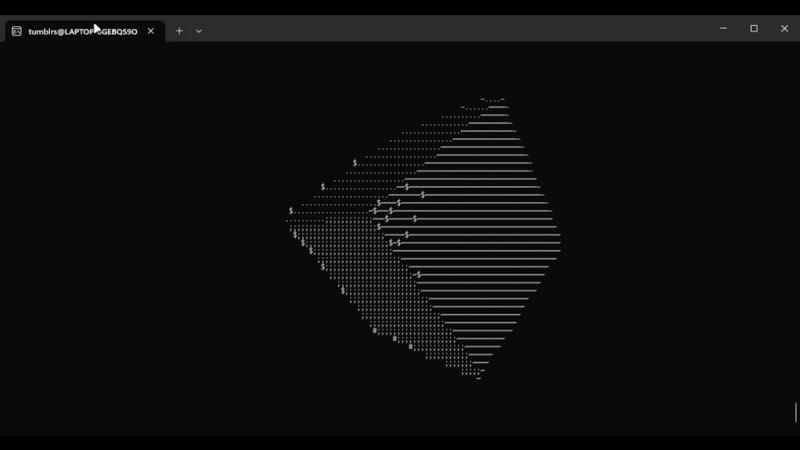
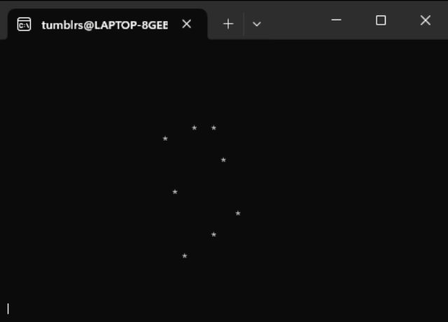
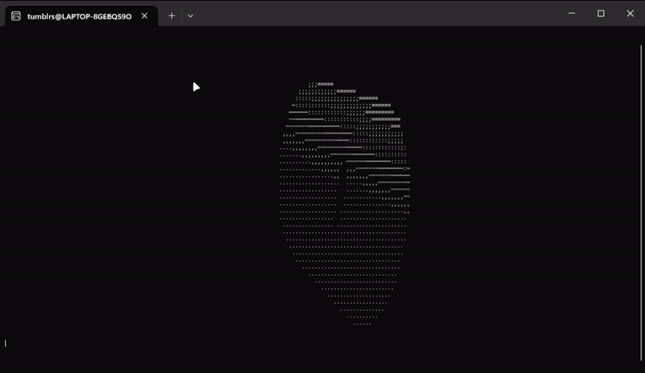
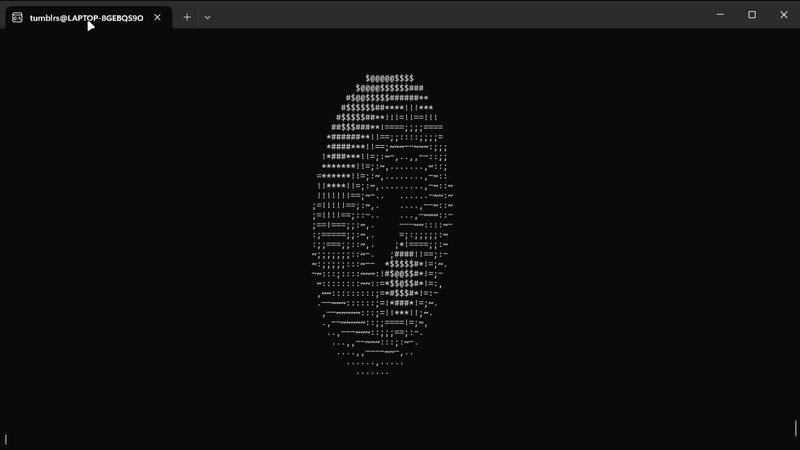

# 3D Projection in CLI

This repository contains implementations of 3D projection algorithms in C, designed to render 3D shapes directly in the command line interface (CLI). Each program demonstrates a unique 3D shape and provides animated visual outputs.

---

## Table of Contents

1. [Features](#features)
2. [Programs](#programs)
3. [Output GIFs](#output-gifs)
4. [How to Run](#how-to-run)
5. [Contributing](#contributing)
6. [License](#license)

---

## Features

- **3D Rendering:** Projects 3D shapes onto a 2D plane using mathematical transformations.
- **Shapes Included:** Cone, Cube, Custom Shape, Cylinder, and Donut.
- **Output Previews:** Animated GIFs of each shape's rendering are included.
- **Optimized for CLI:** Lightweight and efficient rendering in terminal-based environments (Works better in linux environments).


| File Name    | Description                             |
| ------------ | --------------------------------------- |
| `cone.c`     | Renders a 3D cone projection.           |
| `cube.c`     | Renders a 3D cube projection.           |
| `custom.c`   | Renders a user-defined custom shape.    |
| `cylinder.c` | Renders a 3D cylinder projection.       |
| `donut.c`    | Renders a 3D spinning torus(donut) projection. |

---

## Technical Details

The programs use various mathematical concepts including:

- 3D to 2D projection matrices
- Rotation matrices
- Z-buffer implementation
- ASCII character density mapping

---

## Output GIFs

Below are the animated outputs generated by each program. All GIFs are located in the `outputs/` folder.

### Cone



### Cube



### Custom Shape



### Cylinder



### Torus(Donut)



---

## How to Run

1. **Clone the repository:**

   ```bash
   git clone https://github.com/THAMIZH-ARASU/3D-Projection-in-CLI.git
   cd 3D-Projection-in-CLI
   ```

2. **Compile the desired program:**

   ```bash
   gcc <program_name.c> -o output -lm
   ```

   Example:

   ```bash
   gcc cone.c -o cone -lm
   ```

3. **Run the compiled program (in linux):**

   ```bash
   ./output.out
   ```

4. **View the animation in the terminal.**

---

## Contributing

Contributions are welcome! If you have suggestions for improvements or additional features, feel free to fork the repository and submit a pull request.

---

## License

This repository is licensed under the MIT License. See the `LICENSE` file for more details.

